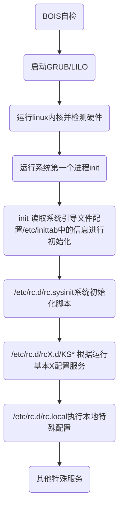
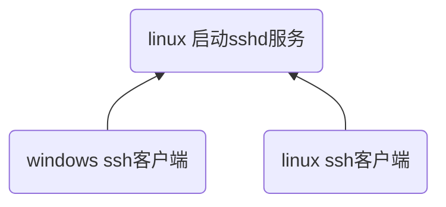

# Linux/网络

## 网络基础

## Linux基础

#### linux启动过程



* GRUB引导界面

### linux目录结构

```shell
/
├── bin # 常用命令
├── boot # 引导文件
├── etc # 配置相关文件
├── home # 普通用户相关文件
├── mnt # 挂在点，默认挂载光驱
├── root # root用户相关文件
├── sbin # 有一定权限才可以使用的命令
├── var # 经常变换的数据
├── usr # 文件默认安装文件夹
├── tmp # 系统临时文件
└── ...
```

* 当前目录 pwd
* 工作目录 运行程序保存的目录

### 用户管理

#### 添加新用户

```shell
useradd xiaoming # 添加用户
passwd xiaoming # 设置密码

userdel xiaoming # 删除用户
userdel -r xiaoming # 删除用户及主目录
```

#### 运行级别

```shell
init [0-6]
# 0关机 1单用户 2多用户状态没有网络服务 3多用户状态有网络服务（常用状态）
# 4系统未使用保留给用户 5图形界面 6系统重启
```

修改运行级别是，需要先改为单用户模式，只有单用户模式才不会调用启动文件

#### 权限管理

* 组管理

```shell
groupadd policeman # 添加组
cat /etc/group # 查看组
```

* 用户组管理

```shell
useradd -g policeman xiaoming # 将xiaoming添加到policeman组中
cat /etc/passwd # 查看用户

# 用户名:密码:用户id:组id:注释(无):用户目录:shell解释器
hughxusu:x:1002:1002::/home/hughxusu/:/bin/bash

usermod -g policeman along # 将用户along添加到policeman组中
usermod -d xiaoming along # 改变用户登录的初始目录
```

* 权限操作

```shell
# 操作权限:文件是1或文件夹下文件数:文件所有者:文件所有组:文件大小(字节):创建时间:文件名
drwxrwxr-x   38 xusu  wheel  1216 Sep 29 09:19 Cellar
# -普通文件 d目录 l链接文件
# 文件类型
# 文件所有者权限 r可读4 w可选2 x可执行1
# 文件所在组对该文件的权限
# 其他用户的权限

chmod 777 along # 修改文件夹权限
chown xusu Frameworks/ # 修改文件夹Frameworks用户所有者为xusu
chgrp policeman Frameworks/ # 修改文件夹Frameworks的所有组为policeman
```

### Linux常用命令

* 建立符号链接

```shell
# ln -s 源 目标
ln -s /home/xioaming/a.out toA
```

* 拷贝  

```shell
# 源 目标
cp a.out /home/xiaoming # 拷贝到/home/xiaoming目录下
```

* 移动

```shell
# 源 目标
mv a.out ../

# 给文件改名
mv a.txt b.txt
```

* 分页

```shell
more install.log # 分页显示 空格下一页
ls -l /etc/ | more # 管道加分页
```

* grep 在文件中查找关键词

```shell
grep "hello" aa.java # 在java文件中查找hello字符串

# 显示在第几行
grep -n "hello" aa.java

# 支持在多个文件中查找，用空格隔开
grep "hello" a.txt ../b.txt
```

* find 查找文件

```shell
find / -name aa.java # 从根目录查找 aa.java文件
# find 可以按照查找，具体查询手册
```

* 重定向命令

```shell
grep "hello" aa.java > a.bak # 保存到a.bak文件中
grep "hello" aa.java >> a.bak # 保存到a.bak文件中，追加写入
```

* 挂载

```shell
mount /mnt/cdrom
umount /mnt/cdrom
```

* 其他

```shell
history # 查阅最近使用命令
history 10 # 最近10个命令
!5 # 执行历史变化为5的命令
! # 上一个命令
```

* 设置系统时间

```shell
date # 显示系统时间
```

* 管道命令

```shell
# 第一个命令结果上继续执行
ls -a | grep "python"
```

* `export`命令

```shell
export PATH=$PATH:/root # 临时加入环境变量
```

* `echo`显示某些变量

```shell
echo $PATH
```

* 通配符

```shell
# * 代表多个字母和数字
# ？代表一个字母和数字
# [] 在一个范围内查找

ls m* # m开始的文件或文件夹
```

* `whoami`打印当前用户

* 查看登录情况

```shell
# 查看登录用户
who

# 与who类似
w
```

* 归档

```shell
# -c 生成档案文件 -v 列出详细过程 -f 制定档案文件名称
# 生成文件 归档文件列表
tar -cvf a.tar a.txt b.txt

# 解包 -x解包文件
tar -xvf a.tar

# -t列出档案中文件的名称
tar -tvf a.tar
```

* 压缩

```shell
# 对文件压缩，生a.tar.gz文件，压缩前文件自动删除
gzip a.tar  

# 解压，解压后解压文件消失
gzi p -d a.tar.gz
```

* 查询文件类型

```shell
file a.out
```

* 查询程序位置

```shell
which git
```

* `tree`命令

```shell
tree -L 1 # 列出一级目录
```

* 使用断开查询

```shell
netstat -nltp
```

### Mac下常用命令

* 文件操作命令

```shell
# pkg-config 安装
brew install pkg-config

# mac下查找库文件命令
pkg-config --libs libavformat
```

### 环境配置

环境配置文件

```shell
/etc/profile

PATH=$PATH:/home/java/bin # 在原path下追加
export JAVA_HOME # 导出路径
```

用户文件夹下`.bash_profile`用户环境变量，在`/etc/profile`可以修改所有用户的环境变量

```shell
# 在 .bash_profile 环境路径，只控制当前用户

PATH=$PATH:/home/java/bin
```

#### 变量

```shell
PATH # 执行程序搜索路径
LD_LIBRARY_PATH # 动态库搜索路径
```

### linux分区

* 基本分区（Primary Partion）：分区后不能在分区，分区后可以马上使用，也叫主分区。
* 扩展分区（Extension Partion）：需要进一步分区才能使用，必须二次分区。二次分区的结果是逻辑分区（Logical Partion）。逻辑分区数量可以有任意个。逻辑分区从5开始排号

基本分区和扩展分区数目之和不能大于4个。上述概念针对一块硬盘。

```shell
fdisk -l # 查看linux系统分区具体情况
df # 查看磁盘使用情况
df -h
```

### shell


Shell：将命令解释成内核可执行的代码

| shell名称 | 开发者     | 命令名称           |
| --------- | ---------- | ------------------ |
| Bourne    | S.R.Bourne | /bin/sh或/bin/bash |
| C         | Bill Joy   | /bin/csh           |
| Kom       | David      | /bin/ksh           |

```shell
env # 显示环境变量

TERM_PROGRAM=Apple_Terminal
NVM_CD_FLAGS=
SHELL=/bin/bash # 使用的shell
TERM=xterm-256color
TMPDIR=/var/folders/s6/zkshgbrj6x7dw4hp_grqtfrc0000gn/T/
CONDA_SHLVL=1
Apple_PubSub_Socket_Render=/private/tmp/com.apple.launchd.waf7IBe9Od/Render
CONDA_PROMPT_MODIFIER=(base) 
TERM_PROGRAM_VERSION=421.2
OLDPWD=/Users/xusu
TERM_SESSION_ID=6D399074-F203-4F1E-8885-A80F9703ACAE
LC_ALL=en_US.UTF-8
NVM_DIR=/Users/xusu/.nvm
USER=xusu
CONDA_EXE=/Users/xusu/DevelopingKits/anaconda3/bin/conda
SSH_AUTH_SOCK=/private/tmp/com.apple.launchd.jtt3mrR6VP/Listeners
_CE_CONDA=
# 环境变量
PATH=/Users/xusu/.nvm/versions/node/v10.15.3/bin:/Users/xusu/DevelopingKits/anaconda3/bin:/Users/xusu/DevelopingKits/anaconda3/condabin:/usr/local/bin:/usr/bin:/bin:/usr/sbin:/sbin
CONDA_PREFIX=/Users/xusu/DevelopingKits/anaconda3
PWD=/bin
LANG=en_US.UTF-8
XPC_FLAGS=0x0
_CE_M=
XPC_SERVICE_NAME=0
SHLVL=1
HOME=/Users/xusu
CONDA_PYTHON_EXE=/Users/xusu/DevelopingKits/anaconda3/bin/python
LOGNAME=xusu
NVM_BIN=/Users/xusu/.nvm/versions/node/v10.15.3/bin
CONDA_DEFAULT_ENV=base
_=/usr/bin/env
```

* shell管理

```shell
chsh -s /bin/csh # 修改当前shell为csh
```

#### shell执行顺序

用户登录后自动执行shell脚本文件

* `.bashrc` 用户登录后执行的命令
* `.bash_profile` 配置用户的环境变量
* `/etc/profile` 配置系统的环境变量，公用环境变量

### 网络

```shell
ping www.baidu.com # 查看百度ip
tracert www.baidu.com # 查看路由路径，linux
traceroute www.baidu.com # 查看路由路径，mac
ifconfig # 查看ip情况

# 网络配置临时生效，重启后回复原有ip
ifconfig eth0 x.x.x.x # 设置网卡ip
ifconfig eth0 network x.x.x.x # 对子网掩码设置 

netstat # 显示目前的网络情况，查看端口占用
netstat -an # 按照端口来排序
netstat -anp # 显示进程占用网络情况
```

### 进程管理

进程：正在执行的程序，进程有独立的地址空间。每个进程都分配一个ID号，进程可以有前台和后台两种形式存在。一般情况下，系统服务都是后台进程。

线程：轻量级进行，没有独立的地址空间。线程不能独立存在，由进程创建。

#### 查询进程

```shell
ps -a # 显示当前终端的所有进程信息
ps -u # 以用户的格式显示进程信息
ps -x # 显示后台进程运行的参数

ps -aux

# 用户| 进程号| cpu占用率| 内存占用率| 虚拟内存| 物理内存| 状态| 启动时间| 时间| 启动命令
USER       PID %CPU %MEM    VSZ   RSS TTY      STAT START   TIME COMMAND
root         1  0.0  0.0 185708  5768 ?        Ss   7月05   4:10 /sbin/init splash
root         2  0.0  0.0      0     0 ?        S    7月05   0:02 [kthreadd]
root         4  0.0  0.0      0     0 ?        I<   7月05   0:00 [kworker/0:0H]
root         6  0.0  0.0      0     0 ?        I    7月05   0:00 [kworker/u32:0]
root         7  0.0  0.0      0     0 ?        I<   7月05   0:00 [mm_percpu_wq]
root         8  0.0  0.0      0     0 ?        S    7月05   0:50 [ksoftirqd/0]
```

#### 终止进程

```shell
kill [进程号]
kill -9 [进程号] # 强制关机
```

#### 进程动态监控

```shell
top # 实时监控进程

     # 系统时间   操作系统运行时间    当前登录用户数  当前系统的负载情况
top - 21:08:34 up 109 days,  5:36,  7 users,  load average: 2.24, 2.33, 2.03
# 进程数             运行数      休眠数           停止数        僵尸进程
Tasks: 541 total,   1 running, 423 sleeping,   6 stopped,   1 zombie
# cpu状态
%Cpu(s):  7.6 us,  4.1 sy,  0.0 ni, 87.8 id,  0.3 wa,  0.0 hi,  0.1 si,  0.0 st
# 内存     总数             空闲           使用
KiB Mem : 65742228 total, 14883476 free, 25842364 used, 25016388 buff/cache
# 虚拟内存    总数						空闲            使用
KiB Swap:   998396 total,   775600 free,   222796 used. 37554988 avail Mem 

 PID USER      PR  NI    VIRT    RES    SHR S  %CPU %MEM     TIME+ COMMAND                                                                                                                                                                                   
 8822 tj        20   0 28.938g 2.904g 1.211g S 104.3  4.6  15:46.82 python                                                                                                                                                                                    
 9051 tj        20   0 17.108g 1.836g 124692 S  21.9  2.9   1:35.91 python                                                                                                                                                                                    
 9054 tj        20   0 17.108g 1.836g 124628 S  21.9  2.9   1:33.20 python                                                                                                                                                                                    
 8880 root      20   0       0      0      0 S  16.2  0.0   2:33.53 nv_queue                                                                                                                                                                                  
25319 999       20   0  9.910g 804484   7904 S   4.6  1.2  11833:09 beam.smp   


# 输入top后
u + 回车 输入用户名 # 监视特定用户
k + 回车 输入进程号 # 终止指定进程

top -d 10 # 指定系统更新进程的时间为10秒
```

### ssh

ssh（secure shell）远程操作linux、进行文件上传和下载的软件。



`sshd`服务默写启动，端口22号

### Vim

* 从命令模式进入编辑模式：`i`插入 / `a`追加
* 命令模式下
  * 保存：`w`   +  [文件名] 保存
  * 删除：
    * 删除一行：`dd`
    * 删除一个单词：`dw`
  * 拷贝：
    * 拷贝一行数据：`yy`
    * 拷贝一个单词：`yw`
  * 将缓冲区文件写入硬盘：`w`+回车
  * 粘贴：`p`
  * 撤销：`u`
  * 光标跳跃：
    * 跳到文件头：`gg`
    * 到最后一行：`g`
    * 跳到行首：shift+`^`
    * 跳到行位：shift+`$`
    * 单词移动：向前`w/2w`，向后`b/2b`
  * 查看行号：`: set nu`
  * 到制定行：行号+`g`
  * 查找：`/`+查找内容
  * 删除光标位置字符：`x`
  * 分窗口：横向`split`/纵向`vsplit`
  * 窗口间跳转：control+`ww`
  * 关闭窗口：`close`
