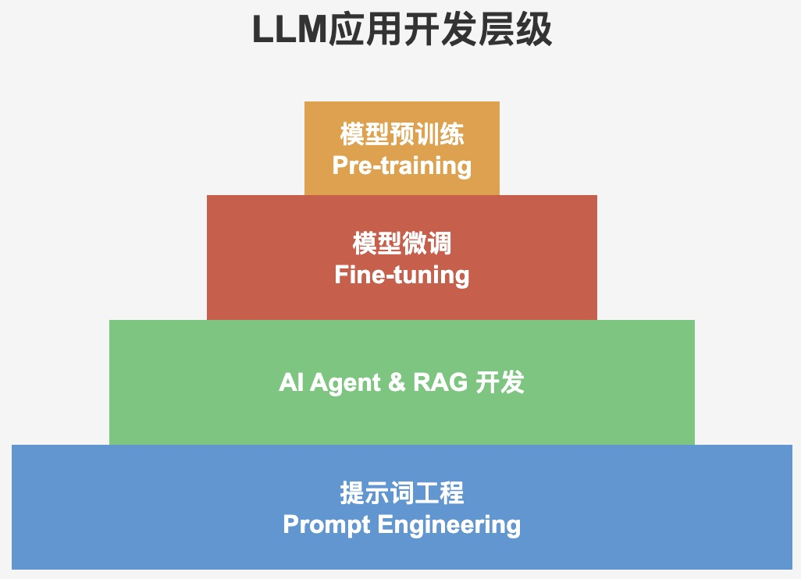
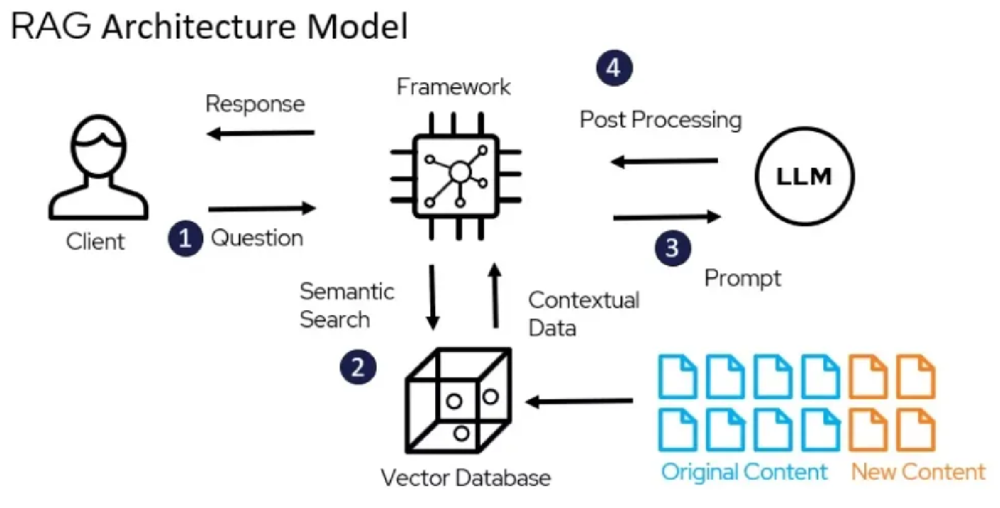
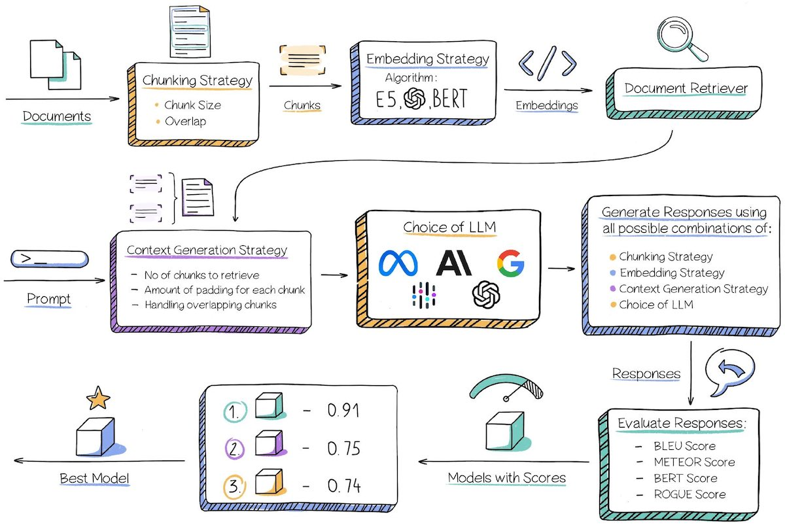

#  AI时代的应用开发

大语言模型（Large Language Model, LLM）是一种基于海量文本数据训练的深度学习模型，能够理解、生成和处理自然语言，广泛应用于文本生成、问答、翻译等任务。

[大语言模型的发展](https://lifearchitect.ai/timeline/?utm_source=chatgpt.com)



## RAG

RAG（Retrieval-Augmented Generation，检索增强生成）是一种结合信息检索与文本生成技术的人工智能模型框架，旨在提升大语言模型在知识密集型任务中的表现。

> RAG = 知识库 + 检索 + 大语言模型



* 知识库：囊括企业私有的数据，满足企业业务需求，可以根据需要进行更新和维护。
* 检索：根据用户的问题，在知识库中找到相关的信息，为回答提供丰富上下文信息。
* 大语言模型：在丰富上下文加持下，大语言模型可以根据上下文信息来回答问题，减缓幻觉，降低生成错误信息的概率。

> [!warning]
>
> RAG可以辅助大语言模型提高答案生成的质量

### RAG的开发

RAG技术面临的主要问题：

1. 企业数据复杂多样化（结构化、非结构化、格式多样），如何处理企业数据？
2. 处理好的数据如何构建知识库（如何分块，如何高效索引）？
3. 用户问答的多样性？
4. RAG中知识增强的关键是获得和问题相关的信息，如何高效的检索？
5. 如何整理检索结果，写出合适的prompt激发大模型潜能？
6. 如何评估RAG项目符合业务要求？



## 选择大模型

课程中选用[腾讯混元大模型](https://cloud.tencent.com/product/hunyuan)

* [计费说明](https://cloud.tencent.com/document/product/1729/97731#5ca71b9a-ad3a-40ec-81d8-1d561d157dae)
* [api key的申请](https://cloud.tencent.com/document/product/1729/111008)
* [如何设置大模型api key的环境变量](https://zhuanlan.zhihu.com/p/627665725)

查看环境变量是否配置成功

```python
import os

hun_api_key = os.getenv("HUN_API_KEY")
print("OpenAI API Key:", hun_api_key)
```

混元大模型[兼容OpenAI接口](https://cloud.tencent.com/document/product/1729/111007)，安装OpenAI调用包`pip install openai`，测试大模型调用。

```python
from openai import OpenAI

client = OpenAI(
    api_key=hun_api_key,  # 混元 APIKey
    base_url="https://api.hunyuan.cloud.tencent.com/v1",  # 混元 endpoint
)

completion = client.chat.completions.create(
    model="hunyuan-lite",
    messages=[
        {
            "role": "user",
            "content": "北方工业大学本科毕业论标题用什么格式字体？"
        }
    ],
    extra_body={
        "enable_enhancement": True, 
    },
)
print(completion.choices[0].message.content)
```


