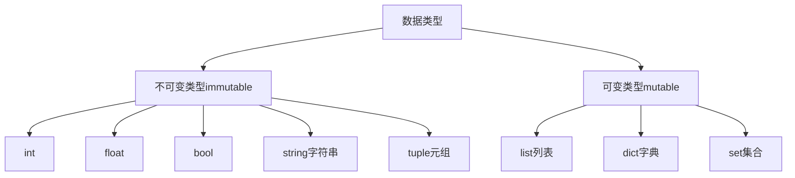

# 基本语法

## 初识函数

### 函数的定义与调用

定义，使用 `def` 关键词

```python
def func_name(params):
    statement_block
```

调用

```python
func_name(params)
```

> [!warning]
>
> 1. 函数的参数可有可无。
> 2. 在 Python 中，函数必须先定义后使用。

无参数函数

```python
def hello() :
    print("Hello World!")

hello()
```

### 函数的参数与返回值

```python
def max(a, b): # 形参
    if a > b:
        return a
    else:
        return b
 
a = 4
b = 5
print(max(a, b)) # 实参
```

1. 形参：定义函数时同时定义了接收用户数据的参数。
2. 实参：调用函数时传入了真实的数据。
3. `return` 可以将函数体中的执行结果传返回到函数调用的位置。


> [!warning]
>
> 函数返回后，后续的程序不会再执行。

## 为函数添加说明

使用 `help` 来查看函数的说明

```python
help(len)
```

为自定义函数添加说明文档

```python
def max(a, b):
    '''
    返回两个数的最大值
    '''
    if a > b:
        return a
    else:
        return b

help(max)
```

## 函数的嵌套调用

计算圆柱和圆锥的体积

```python
def round_area(r):
    return 3.14 * r ** 2

def cylinder(r, h):
    return round_area(r) * h
  
def circular_cone(r, h):
    return cylinder(r, h) / 3

print(round_area(5))
print(cylinder(5, 10))
print(round_area(10) - round_area(5))
```

## 变量的作用域

变量作用域指的是变量生效的范围，主要分为两类：局部变量和全局变量。

### 局部变量

局部变量是定义在函数体内部的变量，即只在函数体内部生效。

```python
def circle():
    pi = 3.14
    print(pi)

circle()
print(pi)
```

### 全局变量

全局变量，指的是在函数体内、外都能生效的变量。

```python
pi = 3.14

def circle():
    print(pi)

def area():
    print(pi)

circle()
area()

# 直接在函数体内修改全局变量
def area():
    pi = 3.1415926
    print(pi)

area()
print(f'全局变量 pi = {pi}')
```

在函数内修改全局变量的正确方法。

```python
pi = 3.14

def area():
    global pi
    pi = 3.1415926
    print(pi)

area()
print(f'全局变量 pi = {pi}')
```

> [!warning]
>
> 全局变量可以用于多个函数之间传递数据。

## 函数多个返回值

```python
def circle(r):
    pi = 3.14
    length = 2 * pi * r
    area = pi * r ** 2
    return length, area

length, area = circle(5)

print(length)
print(area)
```

1. `return length, area` 默认返回的是元组类型。
2. `return` 后面也可以用列表或字典，返回多个值。

## 函数的参数

Python 中函数支持的参数形式包括：

* 必要参数
* 关键字参数
* 默认参数
* 不定长参数

### 必要参数

实参的个数和位置必须与形参保持一致。

```python
def trapezoid(top, bottom, h):
    return (top + bottom) * h / 2

print(trapezoid(3, 5, 4))
```

### 关键字参数

是函数调用一种形式，通过键值对形式指定实参，调用时可以忽略参数顺序。

```python
print(trapezoid(3, h=4, bottom=5)) 
```

> [!warning]
>
> 必要参数和关键字参数一起使用时，必要参数一定在关键字参数之前，且实参个数必须与形参一致。

### 默认参数

在函数定义时，可以为参数指定默认值，调用是可以有默认值的参数形参可以不传。

```python
def trapezoid(top, bottom, h=1):
    return (top + bottom) * h / 2

print(trapezoid(3, 5))
```

> [!warning]
>
> 如果有默认参数，要全部写在函数右侧。

### 不定长参数

不定长参数（可变参数），传入的参数可以个数和值可以任意变化。

#### 元组形式

```python
def print_args(*args):
    print(type(args))
    print(args)

print_args(1, [1, 2], 'red')
print_args([1, 2])
```

1. 在形参前加星号 `*args` ，获取参数时去掉星号。
2. 获取到的参数类型是元组。

#### 字典形式

```python
def print_args(**kwargs):
    print(type(kwargs))
    print(kwargs)

print_args(name='张三', age=18, is_male=True)
```

1. 在形参前加两个星号 `*args` ，获取参数时去掉星号。
2. 获取到的参数类型是字典。

## 引用传参

Python 中变量是一个指针，用于指向数据的内存地址，而所有的数据在 Python 中都是对象。



使用 `id()` 函数可以查看变量的内存地址。

1. 不可变变量，相同的值有唯一的存储地址。可变变量初始化相同的值，会指向不同的内存。

```python
# 不可变类型
a = 1
b = 2
c = 1

print(id(a))
print(id(b))
print(id(c))

a = 'hello, world'
b = 'hello, world!'
c = 'hello, world'

print(id(a))
print(id(b))
print(id(c))

a = 1, 2
b = 1, 1
c = 1, 2

print(id(a))
print(id(b))
print(id(c))

# 可变类型
a = [1, 2]
b = [1, 1]
c = [1, 2]

print(id(a))
print(id(b))
print(id(c))

print(id(a[0]) == id(b[0])) # 数组里相同的不可变类型指向相同的地址
```

2. 不可变变量改变值时会指向新的地址。可变类型改变变量的值不会指向新的地址。

```python
# 1. 不可变类型
a = 1
b = a

print(f'a={a}, b={b}')
print(f'a_id={id(a)}, b_id={id(b)}')

a = 2
print(f'a={a}, b={b}')
print(f'a_id={id(a)}, b_id={id(b)}')

# 2. 可变类型
aa = [10, 20]
bb = aa

print(f'a={aa}, b={bb}')
print(f'a_id={id(aa)}, b_id={id(bb)}')

aa.append(30)
print(f'a={aa}, b={bb}')
print(f'a_id={id(aa)}, b_id={id(bb)}')
```

### 函数参数

```python
def self_add(a):
    print(f'a={a}, a_id={id(a)}')
    a += a
    print(f'a={a}, a_id={id(a)}')

# 1. 不可变类型
b = 100
self_add(b)

# 2. 可变类型
c = [11, 22]
self_add(c)
print(f'c={c}, a_id={id(c)}')
```


