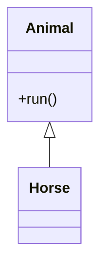
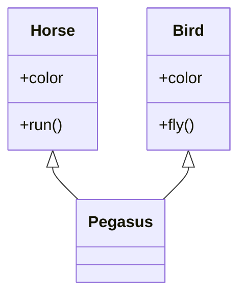
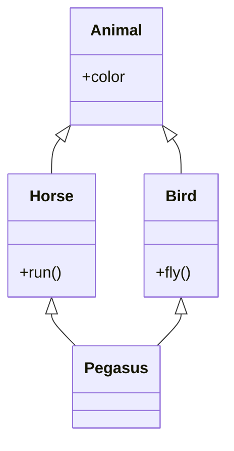
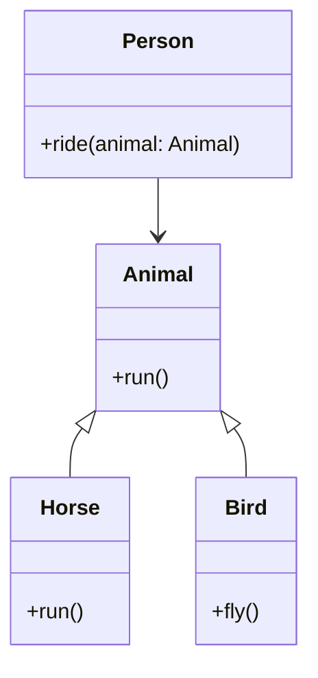

# 面向对象的三大特性

## 继承

### 继承的基本概念

当我们定义一个类的时候，可以从某个现有的类继承，新的类称为子类，而被继承的类称为基类、父类或超类。

语法

```python
class Parent():
    statement_block

class Child(Parent):
    statement_block
```

实例

```python
class Animal(object):
    def run(self):
        print('Animal is running...')

class Horse(Animal):
    pass

horse = Horse()
horse.run()
```

类图




####  经典类和新式类

在Python中，所有类默认继承 `object` 类，`object` 类是顶级类。

```python
class ClzName():
    statement_block

# 等价于
class ClzName(object):
    statement_block
    
# python 2 中的写法
class ClzName:
    statement_block
```

实例

```python
class User:
    pass

class Customer():
    pass

class Manage(object):
    pass

print(User.__mro__) # 使用 __mro__ 可以查看类的继承关系
print(Customer.__mro__)
print(Manage.__mro__)
```

### 多继承

多继承意思就是一个类同时继承了多个父类。

```python
class Horse():
    def __init__(self):
        self.color = 'white'

    def run(self):
        print(f'{self.color} horse is running...')

class Bird():
    def __init__(self):
        self.color = 'blue'

    def fly(self):
        print(f'{self.color} bird is flying')

class Pegasus(Horse, Bird):
    pass

pegsus = Pegasus()
print(pegsus.color)
pegsus.run()
pegsus.fly()
```

类图



### 重写方法和属性

子类和父类具有同名属性和方法，默认使用子类的同名属性和方法。

```python
class Horse():
    def __init__(self):
        self.color = 'white'

    def run(self):
        print(f'{self.color} horse is running...')

class Bird():
    def __init__(self):
        self.color = 'blue'

    def fly(self):
        print(f'{self.color} bird is flying')

class Pegasus(Horse, Bird):
    def __init__(self):
        self.color = 'black'

    def run(self):
        print(f'{self.color} Pegasus is running...')

    def fly(self):
        print(f'{self.color} Pegasus is flying...')

pegsus = Pegasus()
pegsus.run()
pegsus.fly()
```

> [!warning]
>
> 子类和父类具有同名属性和方法，默认使用子类的同名属性和方法。

### 多层继承

```python
class Animal():
    def __init__(self):
        self.color = 'white'

class Horse(Animal):
    def __init__(self):
        self.color = 'red'

    def run(self):
        print(f'{self.color} horse is running...')

class Bird(Animal):
    def __init__(self):
        self.color = 'blue'

    def fly(self):
        print(f'{self.color} bird is flying')

class Pegasus(Bird, Horse):
    def __init__(self):
        self.color = 'black'

    def run(self):
        print(f'{self.color} Pegasus is running...')

    def fly(self):
        print(f'{self.color} Pegasus is flying...')

pegsus = Pegasus()
pegsus.run()
pegsus.fly()
print(Pegasus.__mro__)
```

类图



### 子类中调用父类的方法和属性

```python
class Animal():
    def __init__(self):
        self.color = 'white'

class Horse(Animal):
    def __init__(self):
        self.color = 'red'

    def run(self):
        print(f'{self.color} horse is running...')

class Bird(Animal):
    def __init__(self):
        self.color = 'blue'

    def fly(self):
        print(f'{self.color} bird is flying')

class Pegasus(Bird, Horse):
    def __init__(self):
        self.color = 'black'

    def run(self):
        Bird.__init__(self) # 调用 __init__ 方法会覆盖原本的 color 的值
        print(f'{self.color} Pegasus is running...')

    def fly(self):
        self.__init__() # 如果想调用自身的属性值需要再调用一次 __init__ 方法
        print(f'{self.color} Pegasus is flying...')

pegsus = Pegasus()
pegsus.run()
pegsus.fly()
```

#### `super()`

1. 使用类名调用

```python
class Animal():
    def __init__(self):
        self.color = 'white'

class Horse(Animal):
    def __init__(self):
        self.color = 'red'

    def run(self):
        print(f'{self.color} horse is running...')

class Bird(Animal):
    def __init__(self):
        self.color = 'blue'

    def fly(self):
        print(f'{self.color} bird is flying')

class Pegasus(Horse, Bird):
    def __init__(self):
        self.color = 'black'

    def run(self):
        super(Horse, self).__init__() # 会根据继承链条获取上一个属性值
        print(f'{self.color} Pegasus is running...')

    def fly(self):
        print(f'{self.color} Pegasus is flying...')

pegsus = Pegasus()
pegsus.run()
pegsus.fly()
print(Pegasus.__mro__)
```

2. 默认调用

```python
class Animal():
    def __init__(self):
        self.color = 'white'

class Horse(Animal):
    def __init__(self):
        self.color = 'red'

    def run(self):
        print(f'{self.color} horse is running...')

class Bird(Animal):
    def __init__(self):
        self.color = 'blue'

    def fly(self):
        print(f'{self.color} bird is flying')

class Pegasus(Horse, Bird):
    def __init__(self):
        self.color = 'black'

    def run(self):
        super().__init__() # 获取本类在继承链的上一个属性值
        print(f'{self.color} Pegasus is running...')

    def fly(self):
        print(f'{self.color} Pegasus is flying...')

pegsus = Pegasus()
pegsus.run()
pegsus.fly()
print(Pegasus.__mro__)
```

### 私有属性的继承

私有属性和方法，子类无法继承。

```python
class Horse():
    def __init__(self):
        self.color = 'red'

    def __run(self):
        print('horse is running...')

    def desc(self):
        print('one ', end='')
        print(self.color, end=' ')
        self.__run()

class Bird():
    def __init__(self):
        self.color = 'blue'

    def fly(self):
        print(f'{self.color} bird is flying')

class Pegasus(Horse, Bird):
    def __init__(self):
        self.color = 'black'

    def run(self):
        print(f'{self.color} Pegasus is running...')

    def fly(self):
        print(f'{self.color} Pegasus is flying...')

pegsus = Pegasus()
pegsus.fly()
pegsus.desc()
pegsus.__run()
```

## 多态

多态是一种使用对象的方式，子类重写父类方法，调用不同子类对象的相同父类方法，可以产生不同的执行结果

实现步骤：

- 定义父类，并提供公共方法
- 定义子类，并重写父类方法
- 传递子类对象给调用者，可以看到不同子类执行效果不同

```python
class Animal():
    def run(self):
        print('animal is running...')

class Horse(Animal):
    def run(self):
        print('horse is running...')

class Pig(Animal):
    def run(self):
        print('pig is running')

class Person():
    def ride(self, animal):
        print('a man ride, ', end='')
        animal.run()

horse = Horse()
pig = Pig()
one = Person()
two = Person()
one.ride(horse)
two.ride(pig)
```

类图




## 三大特性

- 封装
  - 类中封装了业务的属性和方法
  - 可以为属性和方法添加私有权限
- 继承
  - 子类默认继承父类的所有属性和方法
  - 子类可以重写父类属性和方法
- 多态
  - 传入不同的对象，产生不同的结果
