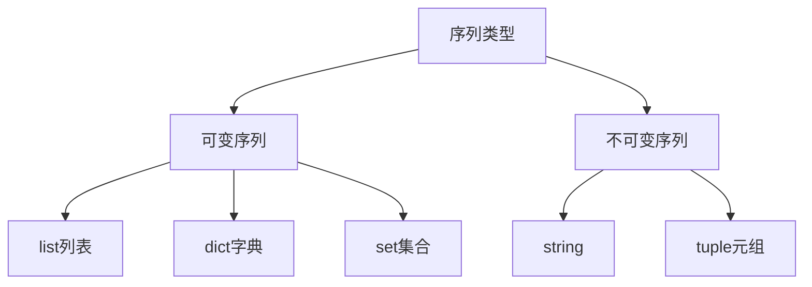

# 序列类型

Python 中内置了一些可同时存储多个数据的类型，这些类型统称为序列类型。

* 序列提供了一系列特有的操作方法。
* 序列类型分为可变序列和不可变序列。
* 序列类型是 Python 内置的数据类型和传统意义上的数据结构，堆、栈、链表等不同。

```mermaid
graph 
序列类型-->可变序列
序列类型-->不可变序列
可变序列-->list列表
可变序列-->dict字典
可变序列-->set集合
不可变序列-->string
不可变序列-->tuple元组

```

