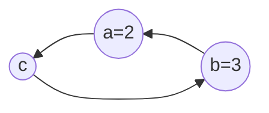

# 元组

元组与列表类似，但是元组内的数据是不能修改。

```python
# 元组的定义
tup = ('Google', 'Runoob', 'Wiki', 'Taobao', 'Wiki', 'Weibo','Weixin')
single = ('Google',) # 单个数据元组，必须加 ',' 否则解释器会把 () 当优先运算符处理。

# 元组定义的简化写法
colors = 'red', 'blue', 'yellow'
colors = 'green',

names = ['Google', 'Runoob', 'Taobao', 'Wiki', 'Weibo','Weixin']
print(type(names))
print(type(tup))
```


## 元组的操作

### 读取

1. 索引

```python
print(tup[0])
tup[0] = 'Tiktok'
```

2. `index()`

```python
print(tup.index('Taobao'))
print(tup.index('Tiktok'))
```

3. `count()`

```python
print(tup.count('Wiki'))
```

4. `len()`

```python
print(len(tup))
```

> [!warning]
>
> 元组中混入列表数据，其中的列表可以修改。
>
> ```python
> group = (1, 2, ['tom', 'andy', 'hugh'], 3)
> print(group[2])  # 访问到列表
> 
> tuple2[2][0] = 'kim'
> print(group)
> ```

#### 拆包

```python
t1 = (10, 20, 30)
a, b, c = t1
print(f'a={a}, b={b}, c={c}')
print(t1)
```

##### 数据交换

交互数据的一般方法



```python
a = 2
b = 3

# 数据交换
c = a
a = b
b = c

print(a)
print(b) 
```

Python 中的数据交换，利用元组的定义与拆包特性。

```python
a, b = 2, 3
a, b = b, a

print(a)
print(b)
```


### 遍历

```python
for item in tup:
    print(item)
```

### 切片

元组切片后返回值是元组。

```python
sub = tup[0:3]
print(sub)
print(type(sub))
print(tup[-1:-4:-1])
```

