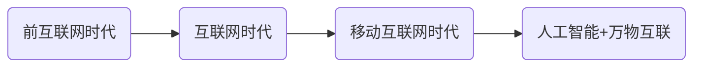
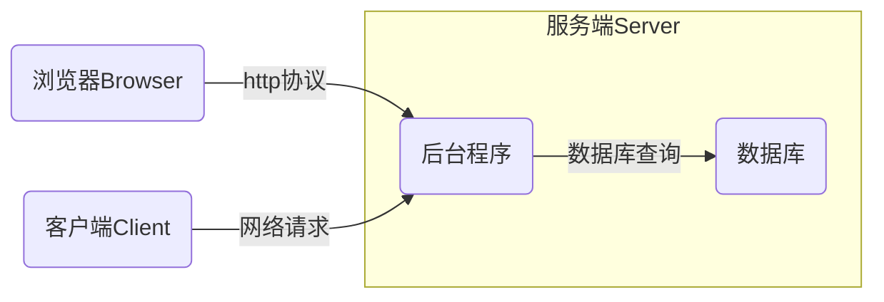

# 了解程序员的工作

## 互联网行业的发展阶段

```mermaid
flowchart LR
    a(前互联网时代) --> b(互联网时代) --> c(移动互联网时代) --> d(人工智能+万物互联)
```

### 互联网服务框架

BS(Browser/Server)与CS(Client/Server)架构

```mermaid
flowchart LR
    a(浏览器Browser) -- http协议 --> c(后台程序)
    b(客户端Client) -- 网络请求 --> c
    subgraph 服务端Server
    c -- 数据库查询 --> d(数据库)
    end
```

## 软件工程师的工作

## Python语言的应用范围

[拉钩网](https://www.lagou.com/)——看看都有哪些工作。
