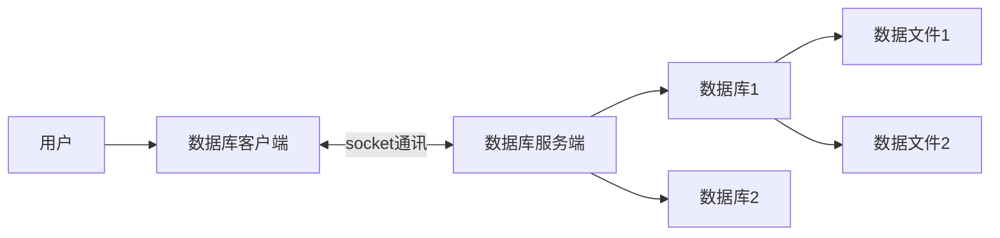

# 数据库基础

数据库就是存储和管理数据的仓库，数据按照一定的格式进行存储，用户可以对数据库中的数据进行增加、修改、删除、查询等操作。

数据库的分类

关系型数据库：用了关系模型来组织数据的数据库。

1. 关系型数据库中核心元素：

   - 数据行

   - 数据列

   - 数据表

   - 数据库（数据表的集合）

2. 常用的关系型数据库：

   - Oracle

   - Microsoft SQL Server

   - MySQL

   - SQLite

非关系型数据库：又被称为NoSQL（Not Only SQL )，意为不仅仅是SQL，对NoSQL 最普遍的定义是“非关联型的”，强调 Key-Value 的方式存储数据。

1. 常用的非关系型数据库:
   - MongoDB
   - Redis

数据库的作用就是存储和管理数据的，比如: 我们在京东网站上的浏览的商品列表数据，这些数据都会存储在数据库。

数据库的特点

1. 持久化存储
2. 读写速度极高
3. 保证数据的有效性

## 关系型数据库管理系统

数据库管理系统（英语全拼：Relational Database Management System，简称RDBMS）是为管理关系型数据库而设计的软件系统。

关系型数据库管理系统可以分为：

- 关系型数据库服务端软件：主要负责管理不同的数据库，而每个数据库里面会有一系列数据文件，数据文件是用来存储数据的, 其实数据库就是一系列数据文件的集合。
- 关系型数据库客户端软件：主要负责和关系型数据库服务端软件进行通信, 向服务端传输数据或者从服务端获取数据.



1. 用户操作关系型数据库客户端，实现数据库相关操作。
2. 关系数据库客户端借助网络使用SQL语言和关系型数据库服务端进行数据通信
3. 关系型数据库服务端管理着不同的数据库，每个数据库会有一系列的数据文件，数据都保存在数据文件里面，每个数据库可以理解成是一个文件夹。

### SQL

SQL（Structured Query Language）是结构化查询语言，是一种用来操作RDBMS的数据库的语言。也就是说通过 SQL 可以操作 oracle,sql server,mysql,sqlite 等关系型的数据库。

SQL语言主要分为

- DQL：数据查询语言，用于对数据进行查询，如select
- DML：数据操作语言，对数据进行增加、修改、删除，如insert、update、delete
- TPL：事务处理语言，对事务进行处理，包括 begin transaction、commit、rollback
- DCL：数据控制语言，进行授权与权限回收，如grant、revoke
- DDL：数据定义语言，进行数据库、表的管理等，如create、drop

> [!note]
>
> 对于程序员来讲，重点是数据的增、删、改、查，必须熟练编写DQL、DML，能够编写DDL完成数据库、表的操作，其它操作如TPL、DCL了解即可。
>
> SQL语言不区分大小写

## MySQL数据库

MySQL是一个关系型数据库管理系统，在 WEB 应用方面，MySQL是最好的 RDBMS (Relational Database Management System，关系数据库管理系统) 应用软件，它是由瑞典MySQL AB 公司开发，目前属于 Oracle 旗下产品，MySQL 是最流行的关系型数据库管理系统中的一个。

MySQL的特点：

1. MySQL是开源的，所以你不需要支付额外的费用。
2. MySQL支持大型的数据库。可以处理拥有上千万条记录的大型数据库。
3. MySQL使用标准的SQL数据语言形式。
4. MySQL可以安装在不同的操作系统，并且提供多种编程语言的操作接口。这些编程语言包括C、C++、Python、Java、Ruby等等。

### 使用 Docker 安装 MySQL

https://hub.docker.com/

```shell
docker run --name mysql -e MYSQL_ROOT_PASSWORD=123456 -p 3306:3306 -d mysql
```

### MySQL 客户端软件

DataGrip https://www.jetbrains.com/zh-cn/datagrip/

