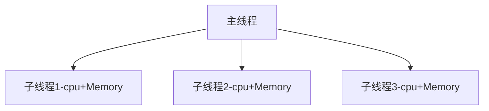

# 进程

一个正在运行的程序或者软件就是一个进程，它是操作系统进行资源分配的基本单位，也就是说每启动一个进程，操作系统都会给其分配一定的运行资源（内存资源）保证进程的运行。

一个程序运行后至少有一个进程，一个进程默认有一个线程，进程里面可以创建多个线程，线程是依附在进程里面的，没有进程就没有线程。


进程是操作系统进行资源分配的基本单位。

## 多进程使用

在Python程序中，想要实现多任务可以使用进程来完成，进程是实现多任务的一种方式。

### 使用进程

`import multiprocessing` 进程包

Process([group [, target [, name [, args [, kwargs]]]]])

* group：指定进程组，目前只能使用None。
* target：执行的目标任务名。
* name：当前进程的别名，默认为Process-N，N为从1开始递增的整数。
* args：以元组方式给执行任务传参。
* kwargs：以字典方式给执行任务传参。

Process创建的实例对象的常用方法：

* start()：启动子进程实例（创建子进程）。
* join()：等待子进程执行结束。
* terminate()：不管任务是否完成，立即终止子进程。

```python
import multiprocessing
import time

def dance():
    for i in range(5):
        print("跳舞中...")
        time.sleep(0.2)

def sing():
    for i in range(5):
        print("唱歌中...")
        time.sleep(0.2)

```

主进程和子进程

```python
if __name__ == '__main__':
    dance_process = multiprocessing.Process(target=dance)
    dance_process.start()
    sing()
```

启动两个子进程

```python
if __name__ == '__main__':
    dance_process = multiprocessing.Process(target=dance)
    sing_process = multiprocessing.Process(target=sing)
    dance_process.start()
    sing_process.start()
```

## 进程的管理

获取进程编号的目的是验证主进程和子进程的关系，可以得知子进程是由那个主进程创建出来的。

获取进程编号的两种操作：

* 获取当前进程编号。
* 获取当前父进程编号。

### 获取当前进程编号

`os.getpid()` 表示获取当前进程编号。

```python
import multiprocessing
import time
import os

def dance():
    for i in range(5):
        print("dance:", os.getpid())
        print("跳舞中...")
        time.sleep(0.2)

if __name__ == '__main__':
    print("main:", os.getpid())
    dance_process = multiprocessing.Process(target=dance)
    dance_process.start()
```

### 获取当前父进程编号

`os.getppid()` 表示获取当前父进程编号。

```python
import multiprocessing
import time
import os

def dance():
    for i in range(5):
        print("dance的父进程编号:", os.getppid())
        print("跳舞中...")
        time.sleep(0.2)

if __name__ == '__main__':
    print("main:", os.getpid())
    dance_process = multiprocessing.Process(target=dance)
    dance_process.start()
```

### 进程控制

```python
import multiprocessing
import time
import os

def dance():
    for i in range(5):
        print("dance:", multiprocessing.current_process())
        print("跳舞中...")
        time.sleep(0.2)
        os.kill(os.getpid(), 9)

def sing():
    for i in range(5):
        print("唱歌中...")
        time.sleep(0.2)

if __name__ == '__main__':
    print("main:", multiprocessing.current_process())
    dance_process = multiprocessing.Process(target=dance)
    dance_process.start()
```

## 使用带有参数的任务

如果进程执行的任务带有参数，可以通过 Process 类执行任务并给任务传参数：

* `args` 表示以元组方式给执行任务传参
* `kwargs` 表示以字典方式给执行任务传参

```python
import multiprocessing

def show_info(name, age):
    print(name, age)
```

`args` 参数的使用

```python
if __name__ == '__main__':
    sub_process = multiprocessing.Process(target=show_info, args=("tom", 18))
    sub_process.start()
```

`kwargs` 参数的使用

```python
if __name__ == '__main__':
    sub_process = multiprocessing.Process(target=show_info, kwargs={"age": 18, "name": 'tom'})
    sub_process.start()
```

## 进程的特点

**进程之间不共享全局变量**

```python
import multiprocessing
import time

g_list = list()

def add_data():
    for i in range(3):
        g_list.append(i)
        print("add:", i)
        time.sleep(0.2)
    print("添加完成:", g_list)

def read_data():
    print("read:", g_list)

if __name__ == '__main__':
    add_process = multiprocessing.Process(target=add_data)
    read_process = multiprocessing.Process(target=read_data)
    add_process.start()
    add_process.join()
    print("main:", g_list)
    read_process.start()
```



创建子进程会对主进程资源进行拷贝，也就是说子进程是主进程的一个副本，好比是一对双胞胎，之所以进程之间不共享全局变量，是因为操作的不是同一个进程里面的全局变量，只不过不同进程里面的全局变量名字相同而已。

**主进程会等待所有的子进程执行结束再结束**

```python
import multiprocessing
import time

def task():
    for i in range(10):
        print("任务执行中...")
        time.sleep(0.2)

if __name__ == '__main__':
    sub_process = multiprocessing.Process(target=task)
    sub_process.start()
    time.sleep(0.5)
    print("over")
```

销毁子进程

```python
if __name__ == '__main__':
    sub_process = multiprocessing.Process(target=task)
    sub_process.start()
    time.sleep(0.5)
    print("over")
    sub_process.terminate()
```

